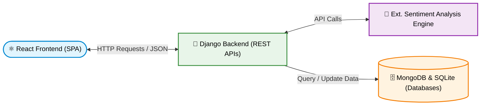
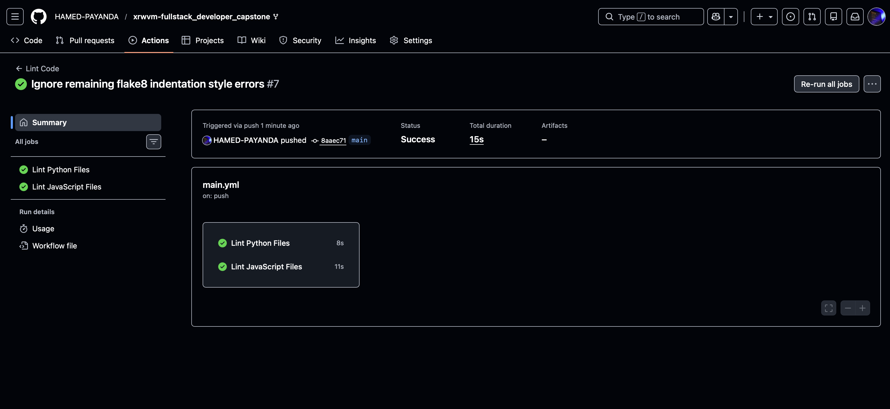
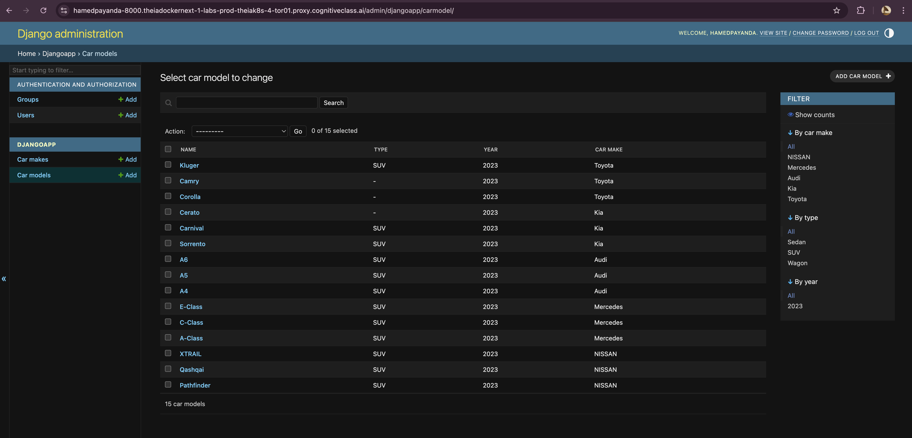
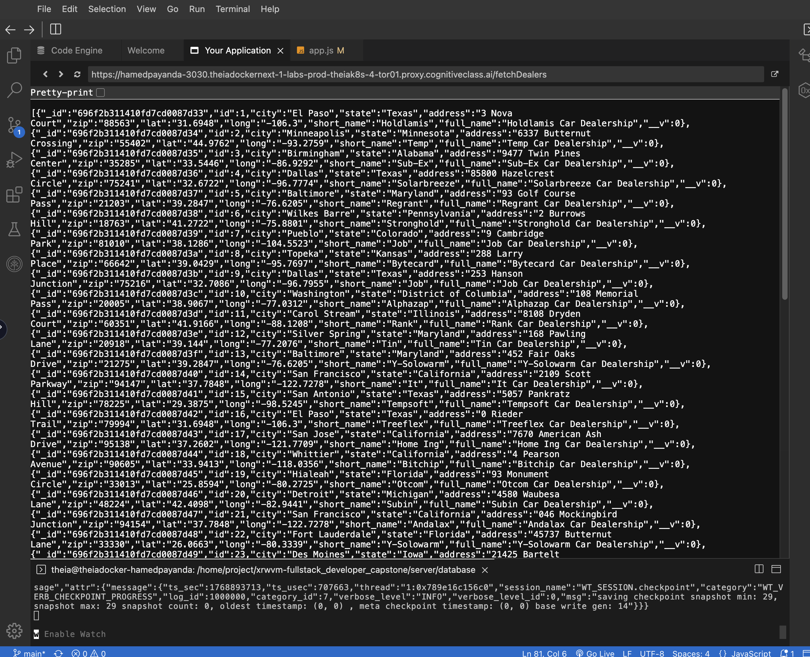
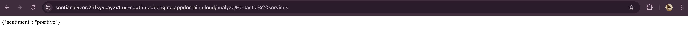
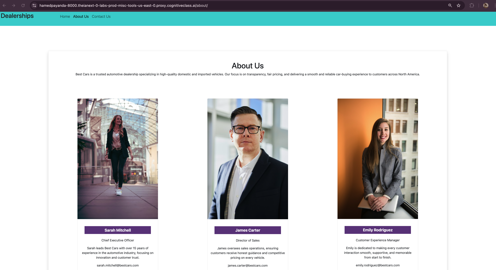
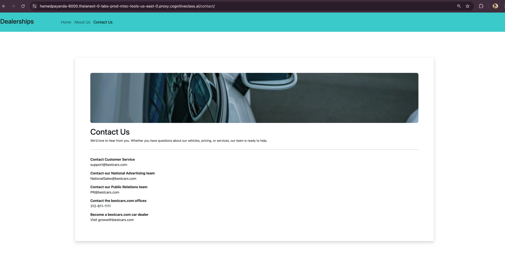

<div align="center">

# 🚘 Full-Stack Dealership Review Web Application

The complete implementation of a microservices-oriented web application, featuring React, Django, MongoDB, and deployed via Kubernetes with automated CI/CD pipelines.

[](#)
[](#)
[](#)
[](#)
[](#)
<br>


<br>
[](https://www.coursera.org/professional-certificates/ibm-full-stack-cloud-developer)


</div>

---

## 📌 Project Overview

This repository contains the complete implementation of a full-stack dealership review web application, developed as the final capstone project for the **IBM Full-Stack Software Developer Professional**. 

The project is a showcase of end-to-end software engineering practices. It goes beyond simple web development by integrating a robust REST API backend, a dynamic frontend, dual-database management, continuous integration workflows, and cloud-native Kubernetes deployment.

---

## 🧱 Microservices Architecture

The application is structured around a decoupled, microservices-oriented architecture:

```text
┌─────────────────┐       ┌─────────────────┐       ┌─────────────────┐
│  React Frontend │ ────> │  Django Backend │ ────> │ Ext. Sentiment  │
│      (SPA)      │ <──── │   (REST APIs)   │ <──── │ Analysis Engine │
└─────────────────┘       └────────┬────────┘       └─────────────────┘
                                   │
                                   ▼
                          ┌─────────────────┐
                          │ MongoDB & SQLite│
                          │   (Databases)   │
                          └─────────────────┘
```

---

## ✨ Key Features

•	🔐 Secure User Authentication: Complete login, logout, and registration workflows managed via SQLite.

•	🚘 Dealership Locator: Browse and filter nationwide dealerships by state.

•	📝 Dynamic Review System: Users can add, read, and manage reviews for specific dealerships.

•	😊 AI Sentiment Analysis: Automatic parsing of user reviews to determine positive, neutral, or negative sentiment.

•	📦 Fully Containerized: Backend services packaged using custom Dockerfiles.

•	🚀 Cloud-Native Deployment: Hosted and orchestrated using IBM Skills Network Kubernetes Clusters.

---

## 🛠️ Core Tech Stack

| Category | Technologies Used | Purpose |
| :--- | :--- | :--- |
| **Frontend UI** | React, JavaScript (ES6+), HTML5/CSS3 | Single Page Application (SPA) client interface |
| **Backend API** | Django, Django REST Framework, Python 3.12 | RESTful routing, backend logic, and API endpoints |
| **Databases** | MongoDB, SQLite | Document store for reviews; Relational DB for auth |
| **DevOps & Cloud** | Docker, Kubernetes, GitHub Actions, IBM Cloud | Containerization, orchestration, and CI/CD automation |

---

## 🔄 CI/CD Pipeline & DevOps

This repository enforces strict code quality and automated deployment pipelines:

•	Continuous Integration: A GitHub Actions workflow (.github/workflows/main.yml) runs automatically on push and pull_request to the main branch.

•	Automated Linting: Python code is checked via Flake8, and JavaScript code is verified via JSHint, preventing non-compliant code from being merged.

•	Container Registry: The backend environment is packaged into a Docker image, containing a custom entry point for database migrations and static files, which is then pushed to the IBM Cloud Container Registry.

•	Kubernetes Orchestration: The application is deployed using declarative Kubernetes manifests (server/deployment.yaml) with port-forwarding configured for lab access.

•	Merge Protection: Blocks pull requests and prevents non-compliant code from being merged if automated continuous integration checks fail.

---

## 🐳 Containerization
```text
•	Backend containerized using Docker.
•	Custom Dockerfile featuring a Python base image, dependency installation, and an entry point for migrations and static files.
•	Image built and pushed to the IBM Cloud Container Registry.
```

## ☸️ Kubernetes Deployment
```text
•	Application deployed using a declarative Kubernetes Deployment manifest (server/deployment.yaml).
•	Port forwarding used for access within the lab environment.
•	The live deployment URL is provided in: deploymentURL.txt
```
---

## 📸 Visual Proof

The following screenshots validate the end-to-end implementation of the application, from CI/CD automation to database management and microservice integration.

**1. Automated CI/CD Pipeline**  
*Demonstrates the GitHub Actions workflow successfully executing continuous integration checks. It highlights the automated static code analysis utilizing Flake8 (Python) and JSHint (JavaScript) prior to deployment.*


**2. Django ORM & Relational Data Management**  
*Highlights the Django Administration panel, proving the successful configuration of the SQLite relational database. It displays the ORM mapping and secure administrative control over the `CarModel` and `CarMake` entities.*


**3. MongoDB Document Retrieval**  
*Displays a raw JSON payload confirming the successful execution of the Django backend REST API endpoints. It verifies the active connection to the MongoDB cluster and the successful retrieval of unstructured dealership documents.*


**4. External AI Sentiment Microservice**  
*Validates the independent cloud deployment of the sentiment analysis engine (hosted on IBM Cloud Code Engine). The microservice successfully accepts string parameters and returns a parsed JSON sentiment evaluation.*


**5. React Frontend Architecture & Routing**  
*Showcases the modular UI components (`AboutUs` and `ContactUs`) rendered by the React frontend. This proves successful client-side routing and the application of responsive, consistent CSS styling.*
  


**6. Authenticated Cloud Deployment**  
*The complete, cloud-hosted application interface accessed via the Kubernetes port-forwarded environment. It demonstrates successful React-to-Django API communication by maintaining a secure user session state (indicated by the active logout functionality).*


---

## 📁 Repository Structure
```text
xrwvm-fullstack_developer_capstone/
├── .github/workflows/
│   └── main.yml               # CI/CD automated linting pipeline
├── server/
│   ├── djangoapp/             # Core Django application logic
│   ├── djangoproj/            # Django project settings and routing
│   ├── database/              # DB connection configurations
│   ├── frontend/              # React application source code
│   ├── Dockerfile             # Container blueprint
│   ├── entrypoint.sh          # Container startup script
│   └── deployment.yaml        # Kubernetes deployment manifest
├── .flake8                    # Python linting rules
├── deploymentURL.txt          # Live K8s deployment access link
└── README.md                  # Project documentation
```
---

## ⚙️ Local Setup & Execution

While this application is designed for cloud-native Kubernetes deployment, you can run the services locally for development and testing purposes.

1. Clone the Repository
```bash
git clone [https://github.com/HAMED-PAYANDA/xrwvm-fullstack_developer_capstone.git](https://github.com/HAMED-PAYANDA/xrwvm-fullstack_developer_capstone.git)
cd xrwvm-fullstack_developer_capstone
```

2. Backend Setup (Django)
Open a terminal and navigate to the server directory to start the backend API:
```bash
cd server
python3 -m venv venv
source venv/bin/activate  # On Windows use `venv\Scripts\activate`
pip install -r requirements.txt
python3 manage.py makemigrations
python3 manage.py migrate
python3 manage.py runserver
```

3. Frontend Setup (React)
Open a new terminal window, navigate to the frontend directory, and start the client interface:
```bash
cd server/frontend
npm install
npm start
```

4. Running via Docker (Alternative)
If you prefer to run the containerized backend using the included Dockerfile:
```bash
cd server
docker build -t dealership-backend .
docker run -p 8000:8000 dealership-backend
```

---

## 🎓 Learning Outcomes

This capstone acts as a comprehensive proof of proficiency in:

•	Full-stack web application development

•	RESTful API design and Frontend-backend integration

•	CI/CD best practices and automated testing

•	Docker containerization and Kubernetes orchestration

•	Cloud-native deployment methodologies

---

## 📜 License

This project is licensed under the [Apache 2.0 License](LICENSE).

---

## 👤 Author

**Hamed Payanda**
* **GitHub:** [@HAMED-PAYANDA](https://github.com/HAMED-PAYANDA)
* Completed as part of the **IBM Full-Stack Software Developer Professional Capstone**.


